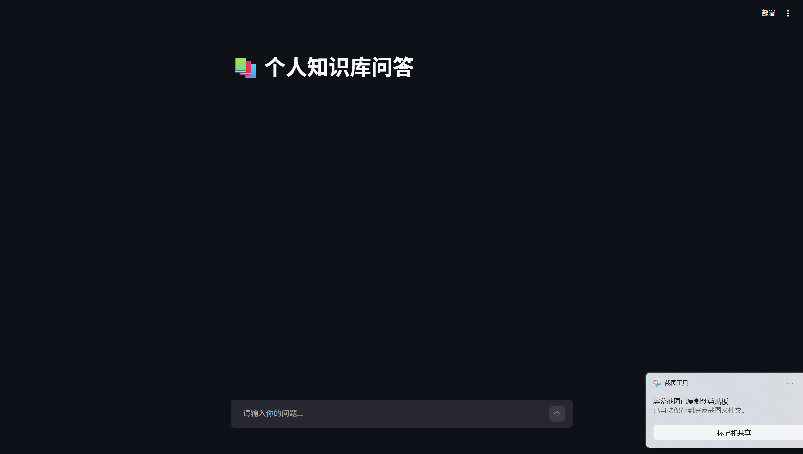
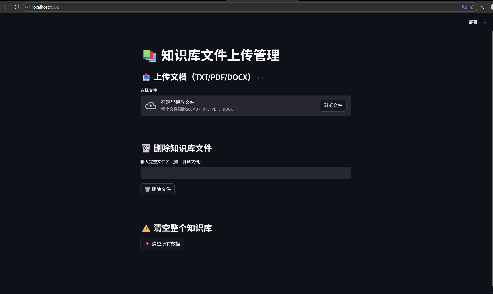

# 个人知识库智能问答系统
基于 FastAPI + Streamlit + LangChain 搭建的 RAG 项目
支持文件上传、流式对话、聊天记忆、向量库管理

## 功能
- TXT/PDF/DOCX 文件解析入库
- 流式AI问答+上下文记忆
- 向量库增删改/清空
- 接口鉴权&异常处理

## 启动
1. 安装依赖：pip install -r requirements.txt
2. 启动后端：uvicorn main:app --reload
3. 启动前端：streamlit run app_qa.py 
           streamlit run app_file_uploader.py 

## 技术栈
- **后端**：FastAPI + LangChain + Chroma
- **前端**：Streamlit
- **模型**：阿里通义千问
- **核心能力**：MD5去重、SSE流式响应、会话隔离
- **向量库**：Chroma / PGVector
